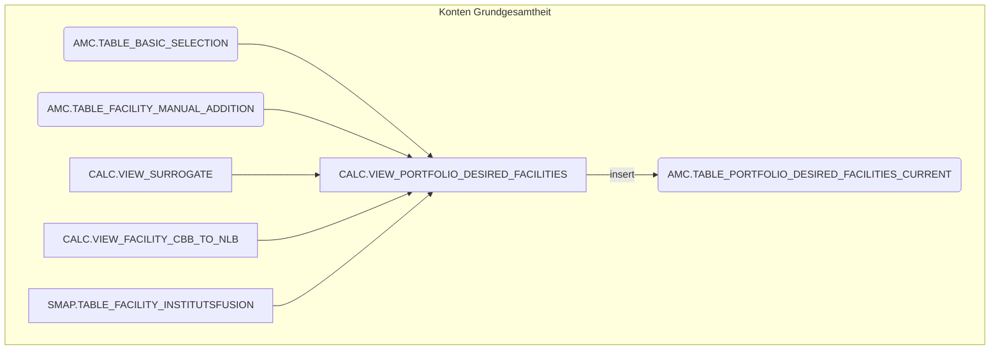
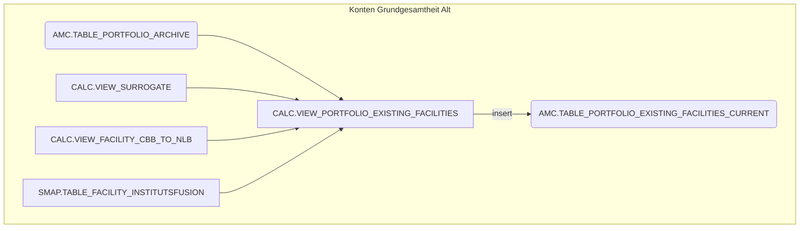
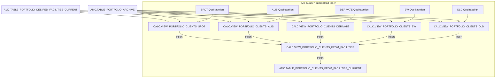
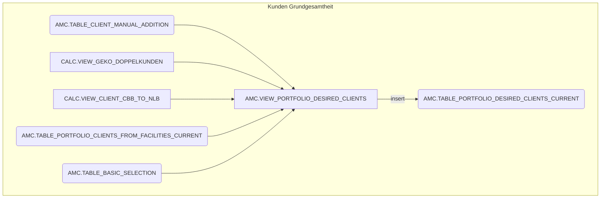
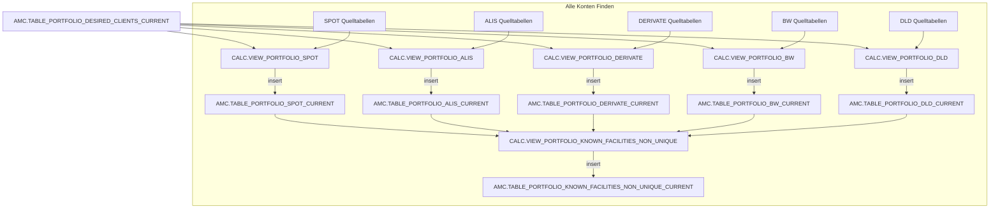
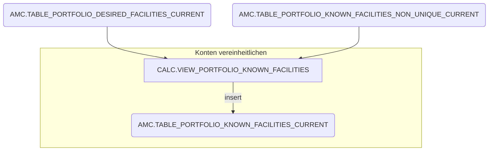
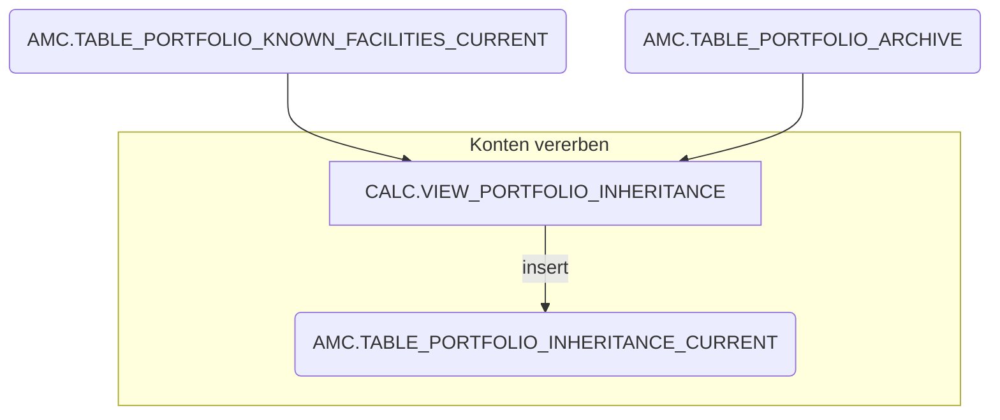

# Portfolio

Portfolio ist die Basis für alle Tapes bestehend aus KR Zulieferung und SPOT Erweiterung. Hier stehen Kunden und
Konten, welche für das Tape relevant sind, also alle Konten von Kunden aus dem entsprechenden Bereich (z.B. Schiffe/
Flugzeuge für AMC). Hier werden auch alternative Kunden- und Kontennummern gesammelt.

## Konten Grundgesamtheit

Als erstes wird eine Liste mit allen gewünschten Konten erstellt. Dazu sammeln 
wir die Manuelle Kontenliste und die Konten aus der KR-GG ein und berechnen 
alternative Kontonummern wie z.B. CBB Equivalente oder Nachfolgekonten.
Dies geschieht in DESIRED_FACILITIES.

## Kunden Grundgesamtheit

Im nächsten Schritt wird die Kunden Grundgesamtheit berechnet. Dazu wird 
zunächst eine Liste aller Kunden zu der Konten Grundgesamtheit erstellt:

Danach können alle Kundenlsiten und die OE Liste vereint werden. Auch hier 
werden Alternative Darstellungen der Kunden identifiziert und mit aufgenommen.
Dies geschieht in DESIRED_CLIENTS. Die Quellen dazu sind die KR Grundgesammtheit 
(BASIC_SELECTION) sowie manuelle Listen (CLIENT_MANUAL_ADDITION). Alternative 
Kundennummern befinden sich in GEKO_DOPPELKUNDEN, CLIENT_CBB_TO_NLB, SURROGATE 
und FACILITY_CBB_TO_NLB.

## Alle Konten Finden

Im zweiten Schritt wird die Kunden GG gegen die einzelnen Quellsysteme gejoint um alle Konten der Kunden zu finden.
Quellsysteme sind:

- SPOT
- ALIS
- DERIVATE
- BW
- DLD

## Konten vereinheitlichen

Im dritten Schritt werden die Konten von allen Quellsystemen vereint. Wenn ein Konto mehrfach vorkommt, wird die
Variante aus dem bevorzugten Quellsystem genommen. Außerdem wird über einen Join mit DESIRED_FACILITIES bestimmt, ob ein
Konto besonders markiert werden soll oder nicht. Am Ende liegt eine Liste aller für den aktuellen Stichtag bekannter
Konten der relevanten Kunden vor.

## Konten vererben

Im vierten Schritt werden die Konten aus anderen Stichtagen mit hinzugezogen. EY braucht Das Konto auch nach dem es
geschlossen wurde mindestens einen Stichtag (7 sind momentan gewünscht) und 1 Stichtag bevor es eröffnet wurde.

