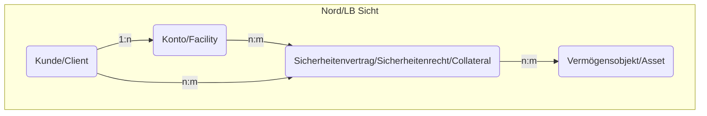
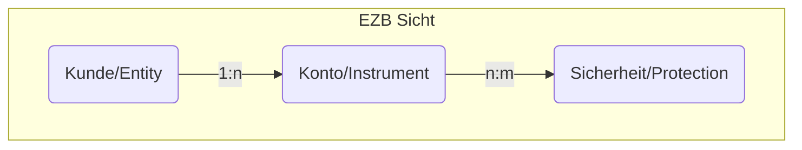

# COLLATERALIZATION / BESICHERUNGSSTRUKTUR

## NordLB Sicht

In der Nord/LB reden wir von Konten, Verträgen und Vermögensobjekten.

## EZB Sicht

In der EZB redet man von Instruments und Protections.

